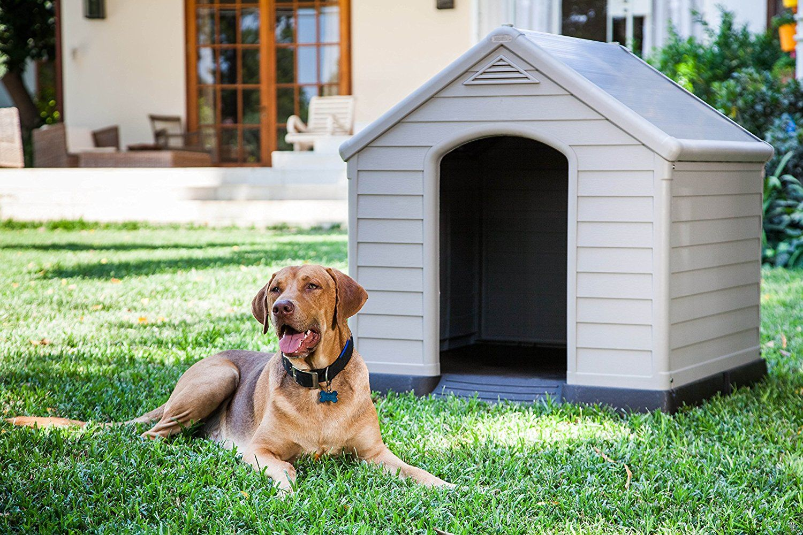

<body>
    

        

            

                
            

            

                

                    <a href="sptarifas.html">Tarifas</a>
                

                

                    <a href="spsocios.html">Socios</a>
                

            

        

    

    

        

            

                
Sparky Canes

                
Cuidado y paseo de perros

            

            

                
            

        

        

            

                <h3>¿Quiénes somos?</h3>
                
En Sparky Canes nos dedicamos con pasión al cuidado integral y el paseo de tus 
                    mejores amigos de cuatro patas. Nuestro compromiso es brindarles atención amorosa, 
                    seguridad y diversión en cada momento que pasan con nosotros.
                

            

            

                
            

        

        

            

                
            

            

                <h3>¿Por qué Sparky Canes?</h3>
                
Elegir Sparky Canes significa optar por un servicio que va más allá del simple 
                    cuidado de mascotas. Nos destacamos por nuestra atención personalizada, compromiso 
                    con la seguridad y el confort de cada perro, y la pasión que tenemos por lo que 
                    hacemos.

            

        

        

            

                <h3>¿Dónde estamos?</h3>
                
Estamos ubicados en <em>Las Magnolias, 119, Urb. Repartición, Comas</em>. Nuestras 
                    instalaciones están diseñadas para proporcionar un ambiente acogedor y seguro, ideal 
                    para el cuidado y el paseo diario de tus amigos peludos.

            

            

                
            

        

    

    

        

            
Políticas de Privacidad

        

        

            
            
            
        

    

</body>
